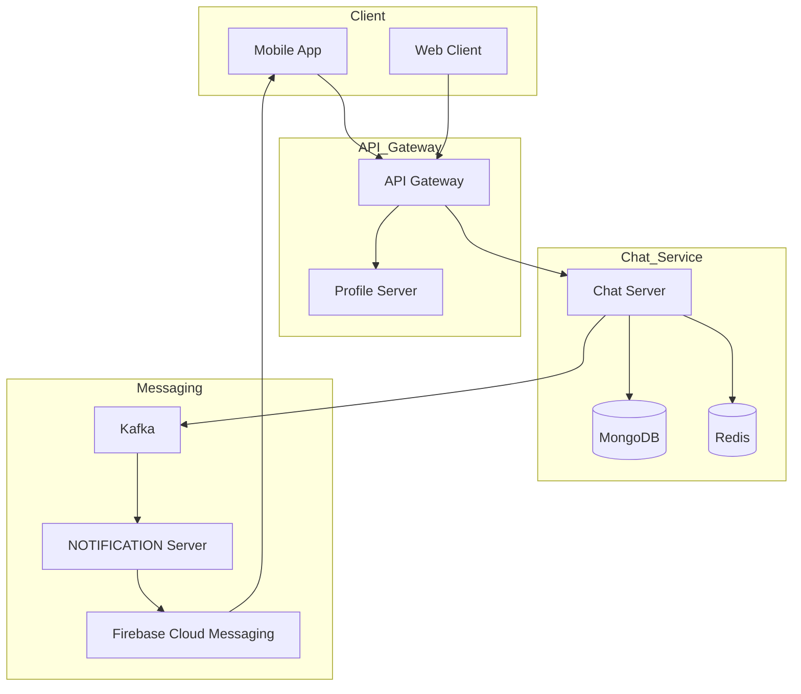
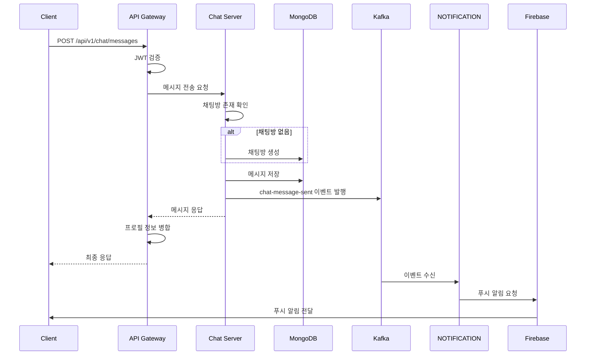
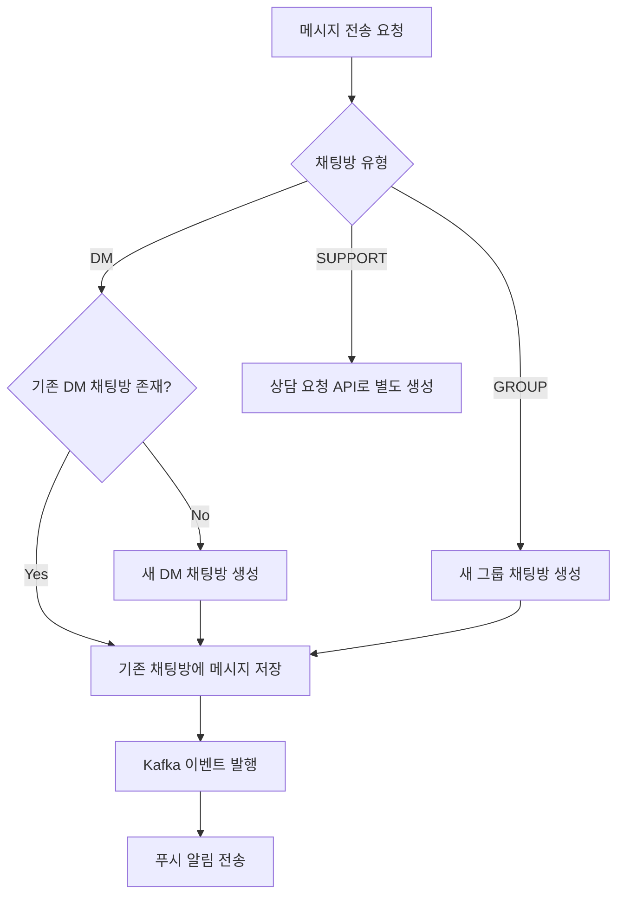
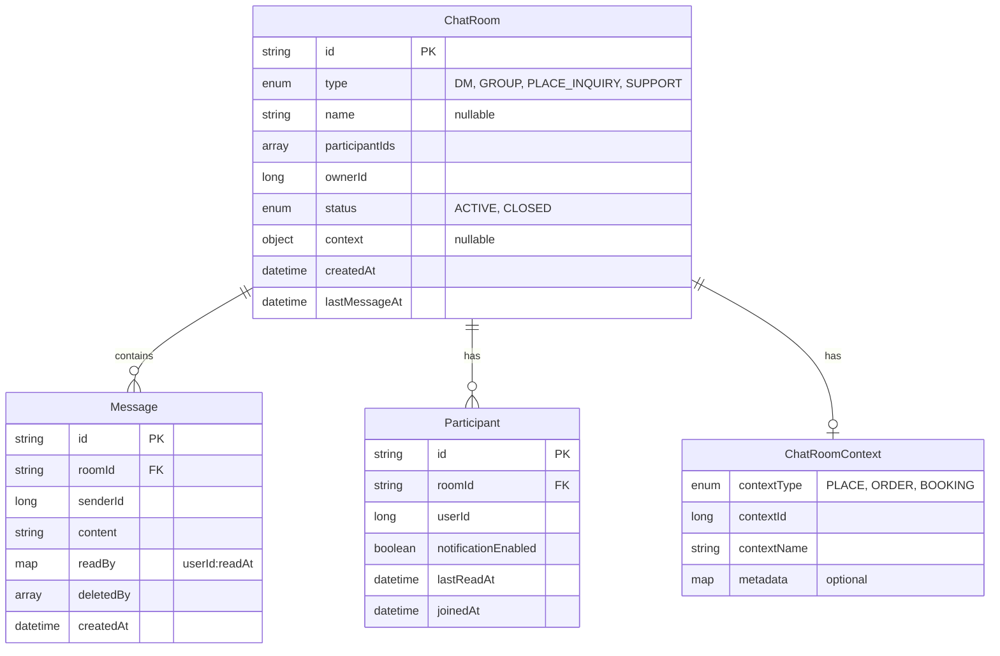
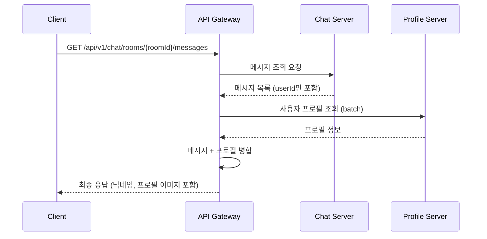

# Chat-Server 가이드 문서

## 1. 개요

### 1.1 목적

Chat-Server는 플랫폼 내 사용자 간 실시간 메시징 기능을 제공하는 마이크로서비스이다.

### 1.2 주요 기능

| 기능 | 설명 |
|-----|------|
| 1:1 DM | 사용자 간 개인 대화 |
| 그룹 채팅 | 다수 사용자가 참여하는 대화 |
| 공간 문의 | 게스트가 호스트에게 특정 공간에 대해 문의 |
| 고객 상담 | 운영팀과 사용자 간 문의 처리 |
| 읽음 확인 | 메시지 읽음 상태 표시 |
| 푸시 알림 | 새 메시지 알림 (NOTIFICATION 서버 연동) |

### 1.3 기술 스택

| 구분 | 기술 |
|-----|------|
| Framework | Spring Boot 3.x |
| Database | MongoDB |
| Message Broker | Apache Kafka |
| Cache | Redis |
| Push | Firebase (NOTIFICATION 서버 경유) |

---

## 2. 시스템 아키텍처

### 2.1 전체 구조



### 2.2 메시지 전송 흐름



### 2.3 채팅방 자동 생성 흐름



---

## 3. 데이터 모델

### 3.1 ERD



### 3.2 컬렉션 상세

#### ChatRoom

| 필드 | 타입 | 필수 | 설명 |
|-----|------|-----|------|
| id | String | Y | UUID |
| type | Enum | Y | DM, GROUP, PLACE_INQUIRY, SUPPORT |
| name | String | N | 그룹 채팅방 이름 |
| participantIds | List<Long> | Y | 참여자 userId 목록 |
| ownerId | Long | Y | 방장 또는 상담원 userId |
| status | Enum | Y | ACTIVE, CLOSED |
| context | Object | N | 컨텍스트 정보 (PLACE_INQUIRY 필수) |
| createdAt | DateTime | Y | 생성 시간 |
| lastMessageAt | DateTime | Y | 마지막 메시지 시간 |

#### ChatRoomContext (Embedded)

| 필드 | 타입 | 필수 | 설명 |
|-----|------|-----|------|
| contextType | Enum | Y | PLACE, ORDER, BOOKING |
| contextId | Long | Y | 연결된 도메인 ID (공간ID, 주문ID 등) |
| contextName | String | N | 표시용 이름 |
| metadata | Map | N | 추가 메타데이터 |

#### Message

| 필드 | 타입 | 필수 | 설명 |
|-----|------|-----|------|
| id | String | Y | UUID |
| roomId | String | Y | 채팅방 ID |
| senderId | Long | Y | 발신자 userId |
| content | String | Y | 메시지 내용 |
| readBy | Map<Long, DateTime> | Y | 읽은 사용자와 읽은 시간 |
| deletedBy | List<Long> | Y | 삭제한 사용자 목록 |
| createdAt | DateTime | Y | 생성 시간 |

#### Participant

| 필드 | 타입 | 필수 | 설명 |
|-----|------|-----|------|
| id | String | Y | UUID |
| roomId | String | Y | 채팅방 ID |
| userId | Long | Y | 사용자 ID |
| notificationEnabled | Boolean | Y | 알림 설정 여부 |
| lastReadAt | DateTime | Y | 마지막 읽은 시간 |
| joinedAt | DateTime | Y | 참여 시간 |

---

## 4. API 명세

### 4.1 메시지

#### 메시지 전송 (채팅방 자동 생성)

```
POST /api/v1/chat/messages
```

**Request**

| 필드 | 타입 | 필수 | 설명 |
|-----|------|-----|------|
| recipientId | Long | 조건부 | 수신자 ID (DM인 경우) |
| recipientIds | List<Long> | 조건부 | 수신자 ID 목록 (GROUP인 경우) |
| roomType | String | Y | DM, GROUP |
| content | String | Y | 메시지 내용 |

**Request Example - DM**

```json
{
  "recipientId": 456,
  "roomType": "DM",
  "content": "안녕하세요"
}
```

**Request Example - GROUP**

```json
{
  "recipientIds": [456, 789, 101],
  "roomType": "GROUP",
  "content": "그룹 채팅을 시작합니다"
}
```

**Response**

```json
{
  "messageId": "msg-uuid-1234",
  "roomId": "room-uuid-5678",
  "senderId": 123,
  "content": "안녕하세요",
  "createdAt": "2024-01-15T10:30:00Z",
  "isNewRoom": true
}
```

#### 메시지 조회

```
GET /api/v1/chat/rooms/{roomId}/messages
```

**Query Parameters**

| 파라미터 | 타입 | 필수 | 기본값 | 설명 |
|---------|------|-----|-------|------|
| cursor | String | N | null | 페이징 커서 (마지막 messageId) |
| limit | Integer | N | 50 | 조회 개수 |

**Response**

```json
{
  "messages": [
    {
      "messageId": "msg-uuid-1234",
      "senderId": 123,
      "content": "안녕하세요",
      "readBy": {
        "456": "2024-01-15T10:31:00Z"
      },
      "createdAt": "2024-01-15T10:30:00Z"
    }
  ],
  "nextCursor": "msg-uuid-1200",
  "hasMore": true
}
```

#### 읽음 처리

```
POST /api/v1/chat/rooms/{roomId}/read
```

**Response**

```json
{
  "roomId": "room-uuid-5678",
  "lastReadAt": "2024-01-15T10:35:00Z",
  "unreadCount": 0
}
```

#### 메시지 삭제

```
DELETE /api/v1/chat/messages/{messageId}
```

**Response**

```json
{
  "messageId": "msg-uuid-1234",
  "deleted": true
}
```

### 4.2 채팅방

#### 채팅방 목록 조회

```
GET /api/v1/chat/rooms
```

**Query Parameters**

| 파라미터 | 타입 | 필수 | 기본값 | 설명 |
|---------|------|-----|-------|------|
| type | String | N | null | DM, GROUP, SUPPORT (필터) |
| cursor | String | N | null | 페이징 커서 |
| limit | Integer | N | 20 | 조회 개수 |

**Response**

```json
{
  "rooms": [
    {
      "roomId": "room-uuid-5678",
      "type": "DM",
      "participantIds": [123, 456],
      "lastMessage": {
        "content": "안녕하세요",
        "senderId": 456,
        "createdAt": "2024-01-15T10:30:00Z"
      },
      "unreadCount": 3
    }
  ],
  "nextCursor": "room-uuid-5600",
  "hasMore": true
}
```

#### 채팅방 상세 조회

```
GET /api/v1/chat/rooms/{roomId}
```

**Response**

```json
{
  "roomId": "room-uuid-5678",
  "type": "DM",
  "name": null,
  "participantIds": [123, 456],
  "ownerId": 123,
  "status": "ACTIVE",
  "createdAt": "2024-01-15T10:00:00Z",
  "unreadCount": 3
}
```

#### 채팅방 나가기

```
DELETE /api/v1/chat/rooms/{roomId}/leave
```

**Response**

```json
{
  "roomId": "room-uuid-5678",
  "left": true
}
```

### 4.3 고객 상담

#### 상담 요청

```
POST /api/v1/chat/support
```

**Request**

```json
{
  "title": "예약 관련 문의",
  "content": "예약 변경이 가능한가요?"
}
```

**Response**

```json
{
  "roomId": "support-uuid-1234",
  "status": "WAITING",
  "queuePosition": 3,
  "createdAt": "2024-01-15T10:00:00Z"
}
```

#### 상담 대기열 조회 (관리자)

```
GET /api/v1/chat/support/queue
```

**Response**

```json
{
  "waitingCount": 5,
  "rooms": [
    {
      "roomId": "support-uuid-1234",
      "userId": 123,
      "title": "예약 관련 문의",
      "createdAt": "2024-01-15T10:00:00Z",
      "waitingMinutes": 15
    }
  ]
}
```

#### 상담원 배정 (관리자)

```
POST /api/v1/chat/support/{roomId}/assign
```

**Request**

```json
{
  "agentId": 999
}
```

**Response**

```json
{
  "roomId": "support-uuid-1234",
  "agentId": 999,
  "status": "IN_PROGRESS"
}
```

#### 상담 종료

```
POST /api/v1/chat/support/{roomId}/close
```

**Response**

```json
{
  "roomId": "support-uuid-1234",
  "status": "CLOSED",
  "closedAt": "2024-01-15T11:00:00Z"
}
```

### 4.4 공간 문의

#### 공간 문의 생성

게스트가 특정 공간에 대해 호스트에게 문의를 시작합니다. 동일 게스트-공간 조합의 중복 문의는 불가합니다.

```
POST /api/v1/chat/inquiry
```

**Headers**

| 헤더 | 필수 | 설명 |
|-----|-----|------|
| X-User-Id | Y | 게스트 userId |

**Request**

| 필드 | 타입 | 필수 | 설명 |
|-----|------|-----|------|
| placeId | Long | Y | 문의 대상 공간 ID |
| placeName | String | Y | 공간 이름 (표시용) |
| hostId | Long | Y | 호스트 userId |
| initialMessage | String | N | 초기 메시지 (선택) |

**Request Example**

```json
{
  "placeId": 12345,
  "placeName": "강남 스터디룸 A",
  "hostId": 200,
  "initialMessage": "예약 문의드립니다"
}
```

**Response**

```json
{
  "roomId": "1234567890123456789",
  "type": "PLACE_INQUIRY",
  "context": {
    "contextType": "PLACE",
    "contextId": 12345,
    "contextName": "강남 스터디룸 A"
  },
  "createdAt": "2024-01-15T10:00:00Z"
}
```

**Error Responses**

| 코드 | HTTP Status | 설명 |
|-----|-------------|------|
| DUPLICATE_INQUIRY | 409 | 이미 해당 공간에 대한 문의 채팅방 존재 |

#### 호스트 문의 목록 조회

호스트가 받은 공간 문의 목록을 조회합니다. 특정 공간으로 필터링할 수 있습니다.

```
GET /api/v1/chat/inquiry/host
```

**Headers**

| 헤더 | 필수 | 설명 |
|-----|-----|------|
| X-User-Id | Y | 호스트 userId |

**Query Parameters**

| 파라미터 | 타입 | 필수 | 기본값 | 설명 |
|---------|------|-----|-------|------|
| placeId | Long | N | null | 특정 공간으로 필터 |
| cursor | String | N | null | 페이징 커서 |
| limit | Integer | N | 20 | 조회 개수 |

**Response**

```json
{
  "inquiries": [
    {
      "roomId": "1234567890123456789",
      "guestId": 100,
      "guestNickname": "홍길동",
      "context": {
        "contextType": "PLACE",
        "contextId": 12345,
        "contextName": "강남 스터디룸 A"
      },
      "lastMessage": "예약 문의드립니다",
      "unreadCount": 1,
      "lastMessageAt": "2024-01-15T10:00:00Z"
    }
  ],
  "nextCursor": "1234567890123456788",
  "hasMore": false
}
```

---

## 5. 이벤트 명세

### 5.1 Kafka Topics

| Topic | Producer | Consumer | 설명 |
|-------|----------|----------|------|
| chat-message-sent | Chat Server | NOTIFICATION | 새 메시지 알림 |
| chat-inquiry-created | Chat Server | NOTIFICATION | 공간 문의 생성 알림 |
| support-requested | Chat Server | NOTIFICATION | 상담 요청 알림 |

### 5.2 이벤트 페이로드

#### chat-message-sent

```json
{
  "eventId": "evt-uuid-1234",
  "eventType": "CHAT_MESSAGE_SENT",
  "timestamp": "2024-01-15T10:30:00Z",
  "payload": {
    "roomId": "room-uuid-5678",
    "messageId": "msg-uuid-1234",
    "senderId": 123,
    "recipientIds": [456],
    "contentPreview": "안녕하세요",
    "roomType": "DM"
  }
}
```

#### chat-inquiry-created

```json
{
  "eventId": "evt-uuid-3456",
  "eventType": "INQUIRY_CREATED",
  "timestamp": "2024-01-15T10:00:00Z",
  "payload": {
    "roomId": "1234567890123456789",
    "guestId": 100,
    "hostId": 200,
    "context": {
      "contextType": "PLACE",
      "contextId": 12345,
      "contextName": "강남 스터디룸 A"
    }
  }
}
```

#### support-requested

```json
{
  "eventId": "evt-uuid-5678",
  "eventType": "SUPPORT_REQUESTED",
  "timestamp": "2024-01-15T10:00:00Z",
  "payload": {
    "roomId": "support-uuid-1234",
    "userId": 123,
    "title": "예약 관련 문의"
  }
}
```

---

## 6. 비즈니스 규칙

### 6.1 채팅방 유형별 규칙

| 규칙 | DM | GROUP | PLACE_INQUIRY | SUPPORT |
|-----|-----|-------|---------------|---------|
| 최대 참여자 | 2명 | 100명 | 2명 (게스트 + 호스트) | 2명 (사용자 + 상담원) |
| 중복 생성 | 불가 (동일 참여자) | 허용 | 불가 (동일 게스트-공간) | 허용 |
| 방장 권한 | 없음 | 초대/강퇴 | 없음 | 상담원만 종료 가능 |
| 나가기 | 가능 | 가능 | 가능 | 불가 (종료만 가능) |
| 컨텍스트 | 없음 | 없음 | 필수 (공간 정보) | 없음 |

### 6.2 메시지 규칙

| 규칙 | 설명 |
|-----|------|
| 최대 길이 | 5,000자 |
| 삭제 | 본인 화면에서만 삭제 (서버 보관) |
| 수정 | 불가 |

### 6.3 읽음 처리 규칙

| 규칙 | 설명 |
|-----|------|
| 읽음 표시 | 채팅방 진입 시 자동 처리 |
| 안읽음 카운트 | lastReadAt 이후 메시지 수 |

---

## 7. API Gateway 연동

### 7.1 프로필 정보 병합

Chat Server는 userId만 반환하며, API Gateway에서 Profile Server를 조회하여 닉네임과 프로필 이미지를 병합한다.



### 7.2 최종 응답 형식

```json
{
  "messages": [
    {
      "messageId": "msg-uuid-1234",
      "sender": {
        "userId": 123,
        "nickname": "홍길동",
        "profileImage": "https://cdn.example.com/profile/123.jpg"
      },
      "content": "안녕하세요",
      "readBy": {
        "456": "2024-01-15T10:31:00Z"
      },
      "createdAt": "2024-01-15T10:30:00Z"
    }
  ]
}
```

---

## 8. 인덱스 설계

### 8.1 MongoDB 인덱스

#### ChatRoom Collection

```javascript
// 사용자별 채팅방 목록 조회
db.chatRoom.createIndex({ "participantIds": 1, "lastMessageAt": -1 })

// DM 중복 체크
db.chatRoom.createIndex(
  { "type": 1, "participantIds": 1 },
  { unique: true, partialFilterExpression: { "type": "DM" } }
)

// 상담 대기열 조회
db.chatRoom.createIndex(
  { "type": 1, "status": 1, "createdAt": 1 },
  { partialFilterExpression: { "type": "SUPPORT" } }
)

// PLACE_INQUIRY 중복 체크 (게스트-공간 조합)
db.chatRoom.createIndex(
  { "type": 1, "context.contextType": 1, "context.contextId": 1, "participantIds": 1 },
  { unique: true, partialFilterExpression: { "type": "PLACE_INQUIRY" } }
)
```

#### Message Collection

```javascript
// 채팅방별 메시지 조회 (페이징)
db.message.createIndex({ "roomId": 1, "createdAt": -1 })

// 안읽은 메시지 카운트
db.message.createIndex({ "roomId": 1, "createdAt": 1 })
```

---

## 9. 에러 코드

| 코드 | HTTP Status | 설명 |
|-----|-------------|------|
| CHAT_001 | 404 | 채팅방을 찾을 수 없음 |
| CHAT_002 | 403 | 채팅방 접근 권한 없음 |
| CHAT_003 | 400 | 잘못된 채팅방 유형 |
| CHAT_004 | 400 | 메시지 내용이 비어있음 |
| CHAT_005 | 400 | 메시지 길이 초과 (5,000자) |
| CHAT_006 | 404 | 메시지를 찾을 수 없음 |
| CHAT_007 | 403 | 메시지 삭제 권한 없음 |
| CHAT_008 | 400 | 수신자가 지정되지 않음 |
| CHAT_009 | 400 | 그룹 채팅 최대 인원 초과 |
| CHAT_010 | 409 | 이미 진행 중인 상담이 있음 |
| DUPLICATE_INQUIRY | 409 | 이미 해당 공간에 대한 문의 채팅방 존재 |

---

## 10. 구현 우선순위

### Phase 1 - 핵심 기능

- 메시지 전송 (채팅방 자동 생성)
- 메시지 조회 (페이징)
- 채팅방 목록 조회
- 읽음 처리
- Kafka 이벤트 발행

### Phase 2 - 확장 기능

- 공간 문의 (PLACE_INQUIRY) - 완료
- 고객 상담 (상담 요청, 배정, 종료)
- 그룹 채팅
- 알림 설정 (채팅방별 on/off)

### Phase 3 - 고도화

- 메시지 검색
- 채팅방 검색
- 메시지 신고

---

## 11. 참고 사항

### 11.1 DM 채팅방 유니크 처리

두 사용자 간 DM 채팅방은 하나만 존재해야 한다. participantIds를 정렬하여 저장함으로써 유니크 제약을 구현한다.

```java
// 예시: userId 123과 456의 DM
// 저장 시 항상 정렬: [123, 456]
List<Long> sortedIds = Stream.of(senderId, recipientId)
    .sorted()
    .collect(Collectors.toList());
```

### 11.2 푸시 알림 조건

- 수신자가 채팅방에 현재 접속 중이 아닌 경우에만 푸시 발송
- 수신자의 알림 설정이 활성화된 경우에만 발송
- 발신자 본인에게는 푸시 발송하지 않음

### 11.3 메시지 삭제 정책

- 사용자가 메시지를 삭제하면 deletedBy 배열에 userId 추가
- 해당 사용자에게는 메시지가 조회되지 않음
- 서버에는 메시지가 영구 보관됨 (법적 요구사항 대응)

### 11.4 공간 문의 (PLACE_INQUIRY)

게스트가 특정 공간에 대해 호스트에게 문의할 때 사용되는 채팅방 유형이다.

**주요 특징**:
- 게스트-공간 조합으로 중복 문의 방지
- ChatRoomContext를 통해 공간 정보 연결
- 호스트가 어떤 공간에 대한 문의인지 즉시 확인 가능

**중복 체크 로직**:
```java
// 동일 게스트가 동일 공간에 문의한 채팅방이 있는지 확인
Optional<ChatRoom> existing = chatRoomRepository
    .findPlaceInquiryByPlaceIdAndGuestId(placeId, guestId);
```

**컨텍스트 타입**:
| 타입 | 설명 | 사용 예 |
|-----|------|--------|
| PLACE | 공간 문의 | 스터디룸, 회의실 등 |
| ORDER | 주문 관련 | (추후 확장) |
| BOOKING | 예약 관련 | (추후 확장) |
